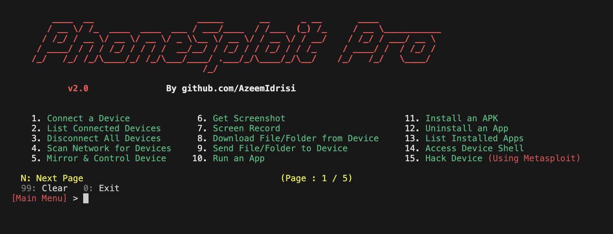
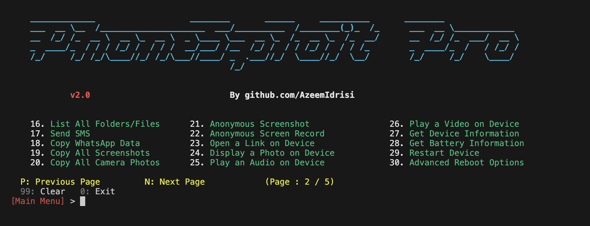

<div align="center">
  
# PhoneSploit Pro
  
### PhoneSploit with Metasploit Integration.

An all-in-one hacking tool written in `Python` to remotely exploit Android devices using `ADB` (Android Debug Bridge) and `Metasploit-Framework`.


</div>

#### Complete Automation to get a Meterpreter session in One Click

This tool can automatically __Create__, __Install__, and __Run__ payload on the target device using __Metasploit-Framework__ and __ADB__ to completely hack the Android Device in one click if the device has open ADB port `TCP 5555`.

The goal of this project is to make penetration testing and vulnerability assessment on Android devices easy. Now you don't have to learn commands and arguments, PhoneSploit Pro does it for you. Using this tool, you can test the security of your Android devices easily.

> [!TIP]
> __PhoneSploit Pro__ can also be used as a complete ADB Toolkit to perform various operations on Android devices over Wi-Fi as well as USB. 

# Screenshots





# Features 
## v1.0

* Connect device using ADB remotely.
* List connected devices.
* Disconnect all devices.
* Access connected device shell.
* Stop ADB Server.
* Take screenshot and pull it to computer automatically.
* Screen Record target device screen for a specified time and automatically pull it to computer.
* Download file/folder from target device.
* Send file/folder from computer to target device.
* Run an app.
* Install an APK file from computer to target device.
* Uninstall an app.
* List all installed apps in target device.
* Restart/Reboot the target device to `System`, `Recovery`, `Bootloader`, `Fastboot`.
* __Hack Device Completely__ : 
  - Automatically fetch your `IP Address` to set `LHOST`.
  - Automatically create a payload using `msfvenom`, install it, and run it on target device.
  - Then automatically launch and setup __Metasploit-Framework__ to get a `meterpreter` session.
  - Getting a `meterpreter` session means the device is completely hacked using Metasploit-Framework, and you can do anything with it.


## v1.1

* List all files and folders of the target devices.
* Copy all WhatsApp Data to computer.
* Copy all Screenshots to computer.
* Copy all Camera Photos to computer.
* Take screenshots and screen-record anonymously (Automatically delete file from target device).
* Open a link on target device.
* Display an image/photo on target device.
* Play an audio on target device.
* Play a video on target device.
* Get device information.
* Get battery information.
* Use Keycodes to control device remotely.


## v1.2

* Send SMS through target device.
* Unlock device (Automatic screen on, swipe up and password input).
* Lock device.
* Dump all SMS from device to computer.
* Dump all Contacts from device to computer.
* Dump all Call Logs from device to computer.
* Extract APK from an installed app.

## v1.3

* Mirror and Control the target device. 

## v1.4

* Power off the target device. 

## v1.5

* Scan local network for connected devices to get Target IP Address. 

## v1.6

* Record Microphone Audio
* Stream Microphone Audio
* Record Device Audio
* Stream Device Audio

# Requirements  
* [`python3`](https://www.python.org/) : Python 3.10 or Newer
* [`pip`](https://pip.pypa.io/en/stable/installation/) : Package installer for Python
* [`adb`](https://developer.android.com/studio/command-line/adb) : Android Debug Bridge (ADB) from `Android SDK Platform Tools`
* [`metasploit-framework`](https://www.metasploit.com/) : Metasploit-Framework (`msfvenom` and `msfconsole`)
* [`scrcpy`](https://github.com/Genymobile/scrcpy) : Scrcpy
* [`nmap`](https://nmap.org/) : Nmap


# Run PhoneSploit Pro 

__PhoneSploit Pro__ does not need any installation and runs directly using `python3`

> [!IMPORTANT]
> **PhoneSploit Pro** requires Python version __3.10 or higher__. Please update Python before running the program.

#### On Linux / macOS :

Make sure all the [required](https://github.com/AzeemIdrisi/PhoneSploit-Pro#requirements) software are installed.

Open terminal and paste the following commands : 
```
git clone https://github.com/AzeemIdrisi/PhoneSploit-Pro.git
```
```
cd PhoneSploit-Pro/
```
```
pip install -r requirements.txt
```
```
python3 phonesploitpro.py
```
#### On Windows :

Make sure all the [required](https://github.com/AzeemIdrisi/PhoneSploit-Pro#requirements) software are installed.


Open terminal and paste the following commands : 
```
git clone https://github.com/AzeemIdrisi/PhoneSploit-Pro.git
```
```
cd PhoneSploit-Pro/
```
```
pip install -r requirements.txt
```
1. Download and extract latest `platform-tools` from [here](https://developer.android.com/studio/releases/platform-tools.html#downloads).

2. Copy all files from the extracted `platform-tools` or `adb` directory to __PhoneSploit-Pro__ directory and then run :

```
python phonesploitpro.py
```

# Tutorial


## Setting up Android Phone for the first time

* __Enabling the Developer Options__

1. Open `Settings`.
2. Go to `About Phone`.
3. Find `Build Number`.
4. Tap on `Build Number` 7 times.
5. Enter your pattern, PIN or password to enable the `Developer options` menu.
6. The `Developer options` menu will now appear in your Settings menu.

* __Enabling USB Debugging__

1. Open `Settings`.
2. Go to `System` > `Developer options`.
3. Scroll down and Enable `USB debugging`.

* __Connecting with Computer__

1. Connect your Android device and `adb` host computer to a common Wi-Fi network.
2. Connect the device to the host computer with a USB cable.
3. Open a terminal in the computer and enter the following command :
```
adb devices
```
4. A pop-up will appear in the Android phone when you connect your phone to a new PC for the first time : `Allow USB debugging?`.
5. Click on `Always allow from this computer` check-box and then click `Allow`.
6. Then in the terminal enter the following command :
```
adb tcpip 5555
```
7. Now you can connect the Android Phone with the computer over Wi-Fi using `adb`.
8. Disconnect the USB cable.
9. Go to `Settings` >  `About Phone` > `Status` > `IP address` and note the phone's `IP Address`.
10. Run __PhoneSploit Pro__ and select `Connect a device` and enter the target's `IP Address` to connect over Wi-Fi.


## Connecting the Android phone for the next time

1. Connect your Android device and host computer to a common Wi-Fi network.
2. Run __PhoneSploit Pro__ and select `Connect a device` and enter the target's `IP Address` to connect over Wi-Fi.


# This tool is tested on

-  ✅ Ubuntu
-  ✅ Linux Mint
-  ✅ Kali Linux
-  ✅ Fedora
-  ✅ Arch Linux
-  ✅ Parrot Security OS
-  ✅ Windows 11
-  ✅ Termux (Android)

> [!NOTE]
> All the new features are primarily tested on **Linux**, thus **Linux** is recommended for running PhoneSploit Pro.
Some features might not work properly on Windows.

# Installing ADB 

#### ADB on Linux :

Open terminal and paste the following commands :

* __Debian / Ubuntu__
```
sudo apt update
```
```
sudo apt install adb
```

* __Fedora__
```
sudo dnf install adb
```

* __Arch Linux / Manjaro__
```
sudo pacman -Sy android-tools
```

For other Linux Distributions : [Visit this Link](https://developer.android.com/studio/releases/platform-tools#downloads)

#### ADB on macOS :

Open terminal and paste the following command :

```
brew install android-platform-tools
```

or Visit this link : [Click Here](https://developer.android.com/studio/releases/platform-tools.html#downloads)

#### ADB on Windows :

Visit this link : [Click Here](https://developer.android.com/studio/releases/platform-tools.html#downloads)

#### ADB on Termux :
```
pkg update
```
```
pkg install android-tools
```


# Installing Metasploit-Framework 

#### On Linux / macOS :
```
curl https://raw.githubusercontent.com/rapid7/metasploit-omnibus/master/config/templates/metasploit-framework-wrappers/msfupdate.erb > msfinstall && \
  chmod 755 msfinstall && \
  ./msfinstall
 ```
 
or Follow this link : [Click Here](https://docs.metasploit.com/docs/using-metasploit/getting-started/nightly-installers.html#installing-metasploit-on-linux--macos)

or Visit this link : [Click Here](https://www.metasploit.com/download)

#### On Windows :

Visit this link : [Click Here](https://www.metasploit.com/download)

or Follow this link : [Click Here](https://docs.metasploit.com/docs/using-metasploit/getting-started/nightly-installers.html#windows-anti-virus-software-flags-the-contents-of-these-packages)

# Installing scrcpy

Visit the `scrcpy` GitHub page for latest installation instructions : [Click Here](https://github.com/Genymobile/scrcpy#get-the-app)

**On Windows** : Copy all the files from the extracted **scrcpy** folder to **PhoneSploit-Pro** folder.

> [!IMPORTANT]  
> If `scrcpy` is not available for your Linux distro like **Kali Linux**, then you can either manually install it : [Manual Guide](https://github.com/Genymobile/scrcpy/blob/master/doc/linux.md),
or build it with a few simple steps : [Build Guide](https://github.com/Genymobile/scrcpy/blob/master/doc/build.md#build-scrcpy)

# Installing Nmap

#### Nmap on Linux :

Open terminal and paste the following commands :

* __Debian / Ubuntu__
```
sudo apt update
```
```
sudo apt install nmap
```

* __Fedora__
```
sudo dnf install nmap
```

* __Arch Linux / Manjaro__
```
sudo pacman -Sy nmap
```

For other Linux Distributions : [Visit this Link](https://nmap.org/download.html)

#### Nmap on macOS :

Open terminal and paste the following command :

```
brew install nmap
```

or Visit this link : [Visit this Link](https://nmap.org/download.html)

#### Nmap on Windows :

Download and install the latest stable release : [Click Here](https://nmap.org/download.html#windows)

#### Nmap on Termux :
```
pkg update
```
```
pkg install nmap
```


# Disclaimer

* Neither the project nor its developer promote any kind of illegal activity and are not responsible for any misuse or damage caused by this project.
* This project is for educational purpose only.
* Please do not use this tool on other people's devices without their permission.
* Do not use this tool to harm others.
* Use this project responsibly on your own devices only.
* It is the end user's responsibility to obey all applicable local, state, federal, and international laws.


# Developer

<a href="https://github.com/azeemidrisi/">
<!--    -->
 

</a>


**Azeem Idrisi** - [@AzeemIdrisi](https://github.com/azeemidrisi/)
 

# Support Me
If you like my work you can support me via :

<a href="https://paypal.me/AzeemIdrisi" target="_blank"> <kbd> </a> <a href="https://www.buymeacoffee.com/AzeemIdrisi" target="_blank"> <kbd> </a>

<hr>

Copyright © 2024 Mohd Azeem (github.com/AzeemIdrisi)
