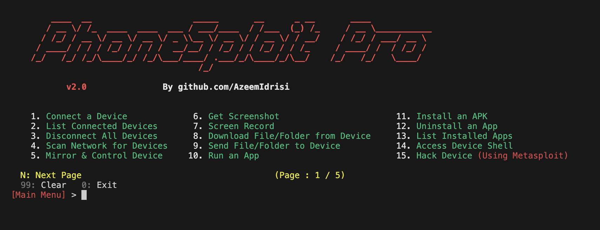
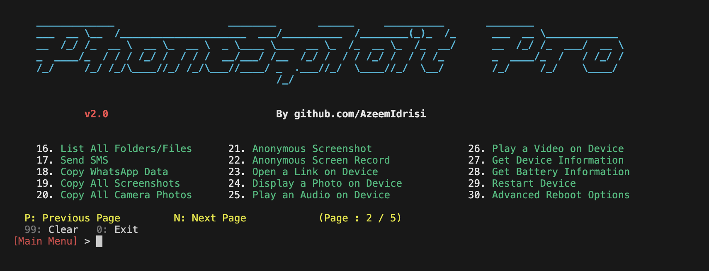
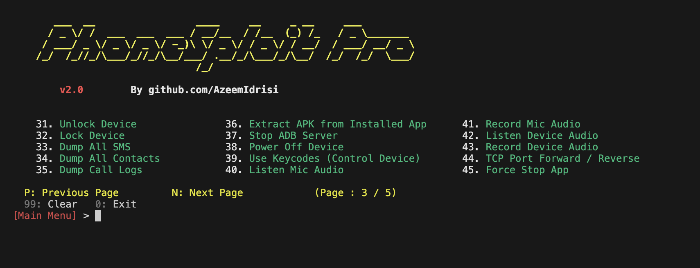
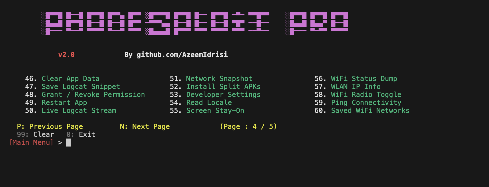

<div align="center">
  
# PhoneSploit Pro
  
### PhoneSploit with Metasploit integration.

An all-in-one hacking tool written in `Python` to remotely exploit Android devices using `ADB` (Android Debug Bridge) and `Metasploit-Framework`.


</div>

## Table of contents

- [Overview](#overview)
- [Screenshots](#screenshots)
- [Features](#features)
- [Requirements](#requirements)
- [Getting started](#getting-started)
- [Device setup tutorial](#device-setup-tutorial)
- [Compatibility](#compatibility)
- [Installing external tools](#installing-external-tools)
- [Disclaimer](#disclaimer)
- [Developer](#developer)
- [Support](#support)

---

## Overview

#### Complete automation to get a Meterpreter session in one click

This tool can automatically __create__, __install__, and __run__ a payload on the target device using __Metasploit-Framework__ and __ADB__ to take full control of the Android device in one click if the device has an open ADB port on `TCP 5555`.

The goal of this project is to make penetration testing and vulnerability assessment on Android devices easy. You no longer need to memorize commands and arguments—PhoneSploit Pro does it for you. Using this tool, you can test the security of your Android devices easily.

> [!TIP]
> __PhoneSploit Pro__ can also be used as a complete ADB toolkit to perform various operations on Android devices over Wi‑Fi as well as USB.

---

## Screenshots






---

## Features

* **Connect a device** — Connect to a device remotely using ADB.
* **List connected devices** — Show all devices currently attached to ADB.
* **Disconnect all devices** — Disconnect every ADB session.
* **Multi-device selection** — If several ADB devices are connected (USB or network), choose which device to use for the session (`ANDROID_SERIAL`).
* **Stop ADB server** — Stop the ADB server process.
* **Access device shell** — Open an interactive shell on the connected device.
* **Keycodes** — Send keycodes to control the device remotely.
* **Unlock device** — Turn the screen on, swipe up, and enter a password when needed.
* **Lock device** — Lock the device.
* **Restart / reboot** — Restart or reboot the device to `System`, `Recovery`, `Bootloader`, or `Fastboot`.
* **Power off** — Power off the target device.
* **Screenshot** — Take a screenshot and pull it to the computer automatically.
* **Screen recording** — Record the target device’s screen for a specified time and pull the recording to the computer automatically.
* **Anonymous screenshot / screen record** — Take screenshots or screen recordings and remove the file from the target device afterward.
* **Mirror and control** — Mirror the screen and control the target device.
* **List files and folders** — List all files and folders on the target device.
* **Download from device** — Download a file or folder from the target device.
* **Send to device** — Send a file or folder from the computer to the target device.
* **Copy WhatsApp data** — Copy all WhatsApp data to the computer.
* **Copy screenshots** — Copy all screenshots to the computer.
* **Copy camera photos** — Copy all camera photos to the computer.
* **Dump SMS** — Export all SMS from the device to the computer.
* **Dump contacts** — Export all contacts from the device to the computer.
* **Dump call logs** — Export all call logs from the device to the computer.
* **Run an app** — Launch an application on the device.
* **Install APK** — Install an APK from the computer to the target device.
* **Install split APKs** — Install apps shipped as multiple APK splits (e.g. split bundles).
* **Uninstall an app** — Remove an installed application.
* **List installed apps** — List all apps installed on the target device.
* **Extract APK** — Extract the APK from an installed app.
* **Force-stop app** — Force-stop a running application.
* **Clear app data** — Clear storage/data for a chosen app (factory reset for that app).
* **Restart app** — Restart an application (force-stop then relaunch).
* **Grant / revoke permission** — Grant or revoke a runtime permission for an app.
* **Open a link** — Open a URL on the target device.
* **Display a photo** — Show an image or photo on the target device.
* **Play audio** — Play an audio file on the target device.
* **Play video** — Play a video on the target device.
* **Send SMS** — Send SMS messages through the target device.
* **Device information** — Read device information.
* **Battery information** — Read battery status and related details.
* **Record microphone audio** — Record audio from the microphone.
* **Stream microphone audio** — Stream live microphone audio.
* **Record device audio** — Record internal device audio.
* **Stream device audio** — Stream live device audio.
* **Hack device completely** — Automated Metasploit flow:
  - Automatically fetch your `IP address` to set `LHOST`.
  - Automatically create a payload using `msfvenom`, install it, and run it on the target device.
  - Automatically launch and set up **Metasploit-Framework** to obtain a `meterpreter` session.
  - A `meterpreter` session means the device is fully compromised via Metasploit-Framework, and you can run further actions from the session.
* **LAN network scan** — Discover hosts on the local network to help find a target IP address; probe TCP ports `5555` and `5554` with service detection and show ADB-related fingerprints and hints for likely Android/ADB targets.
* **TCP port forwarding** — Forward TCP ports over ADB, including reverse forwarding.
* **Save logcat snippet** — Capture a slice of `logcat` output and save it to a file on the computer.
* **Live logcat stream** — Stream `logcat` live from the device.
* **Network snapshot** — Show a snapshot of network interfaces and connectivity on the device.
* **Developer settings** — Open the system **Developer options** screen on the device.
* **Read locale** — Read locale and language settings from the device.
* **Screen stay-on** — Set `svc power stayon` (stay on over USB, stay on always, or turn stay-on off).
* **Wi‑Fi status dump** — Dump detailed Wi‑Fi status from the device.
* **WLAN IP info** — Show WLAN IP addressing information.
* **Wi‑Fi radio toggle** — Turn the Wi‑Fi radio on or off.
* **Ping connectivity** — Run ping checks against a host to test connectivity.
* **Saved Wi‑Fi networks** — List saved Wi‑Fi networks known to the device.
* **Root heuristics** — Heuristic checks for common signs of root access.

---

## Requirements

* [`python3`](https://www.python.org/) — Python 3.10 or newer
* [`pip`](https://pip.pypa.io/en/stable/installation/) — Package installer for Python
* [`adb`](https://developer.android.com/studio/command-line/adb) — Android Debug Bridge (ADB) from Android SDK Platform Tools
* [`metasploit-framework`](https://www.metasploit.com/) — Metasploit-Framework (`msfvenom` and `msfconsole`)
* [`scrcpy`](https://github.com/Genymobile/scrcpy) — scrcpy
* [`nmap`](https://nmap.org/) — Nmap

---

## Getting started

__PhoneSploit Pro__ does not need installation and runs directly with `python3`.

> [!IMPORTANT]
> **PhoneSploit Pro** requires Python version __3.10 or higher__. Please update Python before running the program.

### Linux and macOS

Make sure all [required](#requirements) software is installed.

Open a terminal and run the following commands:

```
git clone https://github.com/AzeemIdrisi/PhoneSploit-Pro.git
```
```
cd PhoneSploit-Pro/
```
```
pip install -r requirements.txt
```
```
python3 phonesploitpro.py
```

### Windows

Make sure all [required](#requirements) software is installed.

Open a terminal and run the following commands:

```
git clone https://github.com/AzeemIdrisi/PhoneSploit-Pro.git
```
```
cd PhoneSploit-Pro/
```
```
pip install -r requirements.txt
```

1. Download and extract the latest `platform-tools` from [here](https://developer.android.com/studio/releases/platform-tools.html#downloads).

2. Copy all files from the extracted `platform-tools` or `adb` directory into the __PhoneSploit-Pro__ directory, then run:

```
python phonesploitpro.py
```

---

## Device setup tutorial

### Setting up an Android phone for the first time

* __Enabling Developer Options__

1. Open `Settings`.
2. Go to `About Phone`.
3. Find `Build Number`.
4. Tap `Build Number` seven times.
5. Enter your pattern, PIN, or password to enable the `Developer options` menu.
6. The `Developer options` menu will now appear in your Settings menu.

* __Enabling USB debugging__

1. Open `Settings`.
2. Go to `System` > `Developer options`.
3. Scroll down and enable `USB debugging`.

* __Connecting with a computer__

1. Connect your Android device and the `adb` host computer to the same Wi‑Fi network.
2. Connect the device to the host computer with a USB cable.
3. Open a terminal on the computer and run the following command:
```
adb devices
```
4. A pop-up will appear on the Android phone when you connect to a new PC for the first time: `Allow USB debugging?`.
5. Select `Always allow from this computer`, then tap `Allow`.
6. Then, in the terminal, run the following command:
```
adb tcpip 5555
```
7. You can now connect the Android phone to the computer over Wi‑Fi using `adb`.
8. Disconnect the USB cable.
9. Go to `Settings` > `About Phone` > `Status` > `IP address` and note the phone’s `IP address`.
10. Run __PhoneSploit Pro__, choose `Connect a device`, and enter the target’s `IP address` to connect over Wi‑Fi.

### Connecting the Android phone the next time

1. Connect your Android device and host computer to the same Wi‑Fi network.
2. Run __PhoneSploit Pro__, choose `Connect a device`, and enter the target’s `IP address` to connect over Wi‑Fi.

---

## Compatibility

This tool is tested on:

-  ✅ Ubuntu
-  ✅ Linux Mint
-  ✅ Kali Linux
-  ✅ Fedora
-  ✅ Arch Linux
-  ✅ Parrot Security OS
-  ✅ Windows 11
-  ✅ Termux (Android)

> [!NOTE]
> New features are primarily tested on **Linux**, so **Linux** is recommended for running PhoneSploit Pro.
Some features might not work properly on Windows.

---

## Installing external tools

If any dependency from [Requirements](#requirements) is missing, use the sections below to install it on your platform.

### ADB

#### Linux

Open a terminal and run the following commands:

* __Debian / Ubuntu__
```
sudo apt update
```
```
sudo apt install adb
```

* __Fedora__
```
sudo dnf install adb
```

* __Arch Linux / Manjaro__
```
sudo pacman -Sy android-tools
```

For other Linux distributions, see: [Android platform-tools downloads](https://developer.android.com/studio/releases/platform-tools#downloads)

#### macOS

Open a terminal and run the following command:

```
brew install android-platform-tools
```

Or download from: [Android platform-tools downloads](https://developer.android.com/studio/releases/platform-tools.html#downloads)

#### Windows

Download from: [Android platform-tools downloads](https://developer.android.com/studio/releases/platform-tools.html#downloads)

#### Termux

```
pkg update
```
```
pkg install android-tools
```

### Metasploit-Framework

#### Linux and macOS

```
curl https://raw.githubusercontent.com/rapid7/metasploit-omnibus/master/config/templates/metasploit-framework-wrappers/msfupdate.erb > msfinstall && \
  chmod 755 msfinstall && \
  ./msfinstall
 ```
 
Or follow: [Installing Metasploit on Linux / macOS](https://docs.metasploit.com/docs/using-metasploit/getting-started/nightly-installers.html#installing-metasploit-on-linux--macos)

Or visit: [Metasploit download](https://www.metasploit.com/download)

#### Windows

Visit: [Metasploit download](https://www.metasploit.com/download)

Or see: [Windows: antivirus and installers](https://docs.metasploit.com/docs/using-metasploit/getting-started/nightly-installers.html#windows-anti-virus-software-flags-the-contents-of-these-packages)

### scrcpy

Visit the `scrcpy` GitHub page for the latest installation instructions: [scrcpy — get the app](https://github.com/Genymobile/scrcpy#get-the-app)

**On Windows**: Copy all files from the extracted **scrcpy** folder into the **PhoneSploit-Pro** folder.

> [!IMPORTANT]  
> If `scrcpy` is not available for your Linux distribution (for example **Kali Linux**), you can install it manually ([Linux guide](https://github.com/Genymobile/scrcpy/blob/master/doc/linux.md))
or build it in a few steps ([Build guide](https://github.com/Genymobile/scrcpy/blob/master/doc/build.md#build-scrcpy)).

### Nmap

#### Linux

Open a terminal and run the following commands:

* __Debian / Ubuntu__
```
sudo apt update
```
```
sudo apt install nmap
```

* __Fedora__
```
sudo dnf install nmap
```

* __Arch Linux / Manjaro__
```
sudo pacman -Sy nmap
```

For other Linux distributions, see: [Nmap download](https://nmap.org/download.html)

#### macOS

Open a terminal and run the following command:

```
brew install nmap
```

Or visit: [Nmap download](https://nmap.org/download.html)

#### Windows

Download and install the latest stable release: [Nmap for Windows](https://nmap.org/download.html#windows)

#### Termux

```
pkg update
```
```
pkg install nmap
```

---

## Disclaimer

* This project and its developer do not promote any illegal activity and are not responsible for any misuse or damage caused by this project.
* This project is for educational purposes only.
* Please do not use this tool on other people’s devices without their permission.
* Do not use this tool to harm others.
* Use this project responsibly and only on your own devices or with explicit authorization.
* It is the end user’s responsibility to obey all applicable local, state, federal, and international laws.

---

## Developer

<a href="https://github.com/azeemidrisi/">
<!--    -->
 

</a>


**Azeem Idrisi** - [@AzeemIdrisi](https://github.com/azeemidrisi/)
 

## Support

If you like my work, you can support me via:

<a href="https://paypal.me/AzeemIdrisi" target="_blank"> <kbd> </a> <a href="https://www.buymeacoffee.com/AzeemIdrisi" target="_blank"> <kbd> </a>

<hr>

Copyright © 2026 Azeem Idrisi (github.com/AzeemIdrisi)
